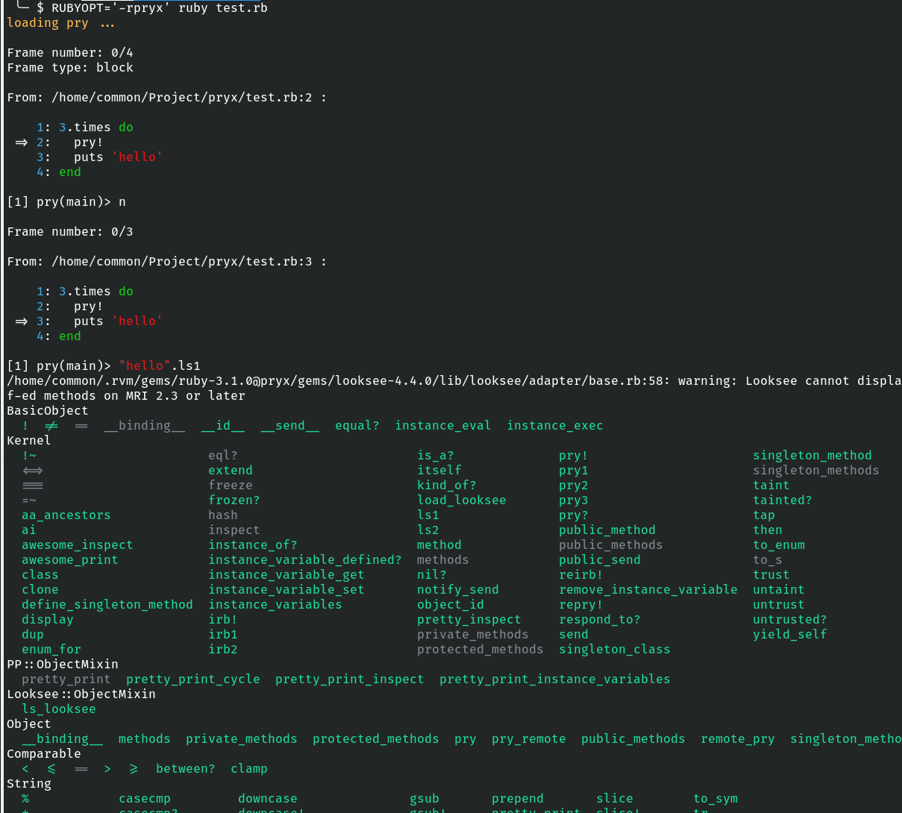
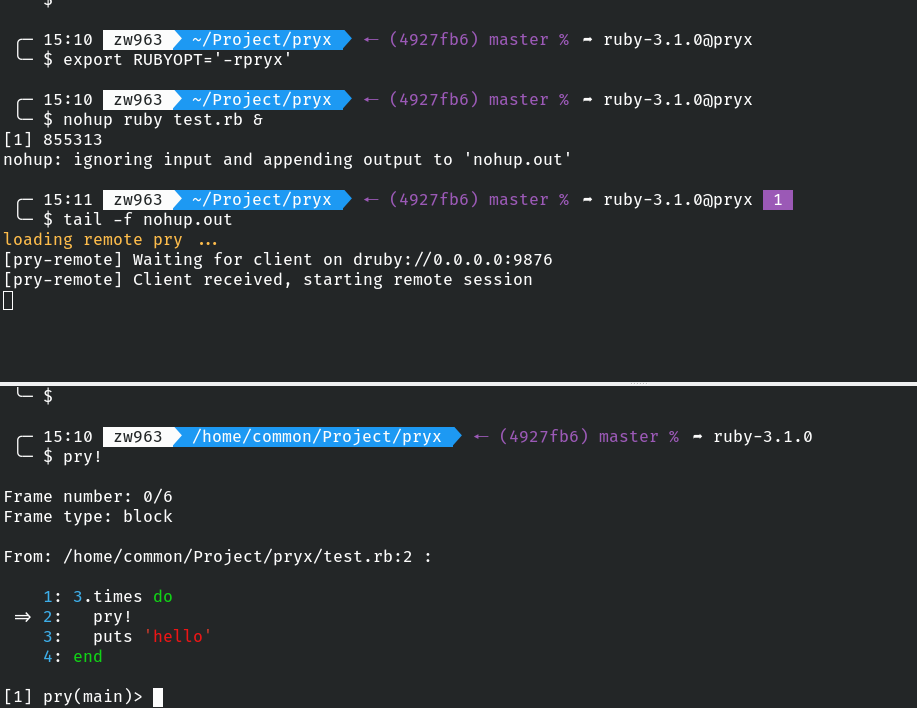
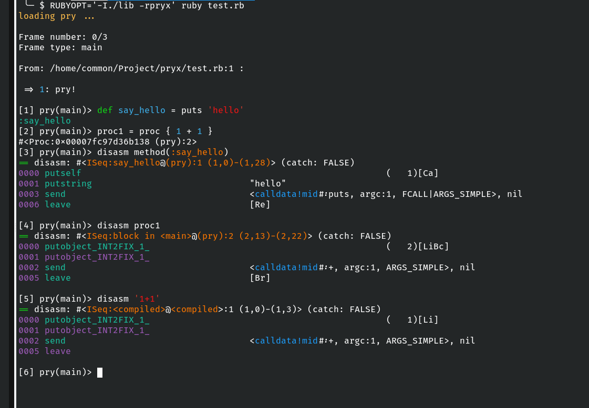

# Pryx [](https://app.travis-ci.com/github/zw963/pryx)[](http://badge.fury.io/rb/pryx)

Three Virtues of a Programmer: Laziness, Impatience, and Hubris. -- Larry Wall, the author of Perl Programming language.

## Getting Started

Don't add this gem into bundler's Gemfile.

Instead, install it directly via RubyGems

    $ gem install pryx
	
Then use can use pryx cross all your's project.	

## Usage

Before use it, you need set `RUBYOPT` variable.

You can do this two way in a terminal.

```sh
$: export RUBYOPT+=' -rpryx'
$: ruby your_file.rb              # add pry! in your_file for start pry session

```

or Run your's code directly use:

```sh
$: RUBYOPT+='-rpryx' ruby your_file.rb  # add pry! in your_file for start pry session
```

Then, try add `pry!` into your's ruby code, then run it, have fun!

Following is a example, assume we have test.rb, it content like this:

```rb
# test.rb
3.times do
  pry!
  puts 'hello'
end
```

Then, when you run `RUBYOPT='-rpryx' ruby test.rb`



You can even connect to a pry session started from remote or background process 
use http connection.




Until now, you've only seen the tip of the iceberg, please have a try.


If you prefer to use IRB over Pry, use can add following code instead.

```sh
$: export RUBYOPT+=' -rpryx_irb'
$: ruby your_file.rb              # add pry! in your_file for start pry session
```

__WARN__: `require 'pryx_irb'` will enable many gems by default in your's ruby code.
so, prefer to use `require 'pryx'`, because latter almost not affect your's code,
only several methods added into Kernel#, and gems only be require if you run invoke
those added methods.

## useful command which added directly to Kernel#

### Kernel#pry!   
   
start a pry session, this session only can be intercept once if add into a loop.
when used with a rails/roda web server, it only intercept one per request.

we have IRB equivalent, named `irb!`, for use more nice feature, use following code instead:

```sh
$: RUBYOPT+='-rpryx_irb' ruby your_file.rb # add irb! in your_file for start pry session
```

Following feature both available when start a Pry or IRB session:

1.  Add `next/step/up/down` command for debug, use [break](https://github.com/gsamokovarov/break) [pry-stack_explorer](https://github.com/pry/pry-stack_explorer)
2.  Add `Kernel#ls1`(use ls1 to avoid conflict with pry builtin ls command), see [looksee](https://github.com/oggy/looksee)
3.  Use `ap` for pretty print. see [awesome-print](https://github.com/awesome-print/awesome_print)
4.  Use `Clipboard.copy` or `Clipboard.paste` to interactive with system clipboard. see [clipboard](https://github.com/janlelis/clipboard)

Following is pry command available only after start a Pry session:

1.  Add `$/?` command for see source, see [pry-doc](https://github.com/pry/pry-doc)
2.  pry-remote debug support. you still use `pry!` no changes, it will use `pry-remote` automatically
    if current ruby process was running on backround, then, it will use pry-remote, and listen on 0.0.0.0:9876,
    Then, you can connect to it from another terminal! see [pry-remote](https://github.com/Mon-Ouie/pry-remote)
3.  Add `pa` command, see [pry-power_assert](https://github.com/yui-knk/pry-power_assert)
4.  Add `hier` command for print the class hierarchies, see [pry-hier](https://github.com/phaul/pry-hier)
5.  Add `pry-aa_ancestors` command for print the class hierarchy, see [pry-aa_ancestors](https://github.com/tbpgr/pry-aa_ancestors)
6.  Add `up/down/frame/stack` command, see [pry-stack_explorer](https://github.com/pry/pry-stack_explorer)
7.  Add `yes` or `y` command, see [pry-yes](https://github.com/christofferh/pry-yes)
9.  Add `pry-disam`, Check following screenshot for a example:



### Kernel#pry1 Kernel#pry2  (sorry for this bad name, please create a issue you have a better one)

pry2 do nothing, but it will be interceptd and start a pry session only after pry1 is running.

I haven use this hack for avoid pry session start on working place.

You know what i means.

### Kernel#irb1 Kernel#irb2 

IRB equivalent for pry1, pry2
we have irb1 and irb2 too.

### Kernel#pry3

It just normal `binding.pry`, that is, will always be intercept if code can reach.
but above plugins and libraries all correct configured.

we have another Kernel#pry?, which enable `pry-state` automatically, see [pry-state](https://github.com/SudhagarS/pry-state)

### Add CLI command, rescue, kill-pry-rescue, pryx, irbx, pry!

`rescue` and `kill-pry-rescue` come from `pry-rescue` gem, it not load by default, but you can use rescue command from command line directly.
see [pry-rescue](https://github.com/ConradIrwin/pry-rescue)

pryx is same as pry, but, with plugins and libraries correct configured, it will load `./config/environment.rb` if this file exists.

irbx is same things for irb.

`pry!` just a alias to `binding.pry`, but, if process is running on background, it a alias to `binding.remote_pry('0.0.0.0', 9876)`, 
you can specify host or port manually, like this: `pry!(host: '192.168.1.100')`. 
in another terminal, you can run `pry!` directly to connect to it use IP + port.

e.g. assume your's pry-remote server started background on another host(192.168.1.100), port 9876
It maybe in container, you can connect remote pry like this:

```sh
$: pry! -s 192.168.1.100 -p 9876
```

## Philosophy

This gem is design to Minimal impact on target ruby code, in fact, after `require 'pryx'` or `RUBYOPT='-rpryx'`
(they do same thing), only several instance method be defined on Kernel, and several gems add to $LOAD_PATH, 
but not load, ready to require it, no more. so, it should be safe to use it, either affect performance nor
namespace/variables etc.

But, you should only use it in development, though, it was tested is run in container(alpine) too.

## Limit

  1. `break` not work well if you add more than one break point, but still use `next` goto the next break point,
     See https://github.com/gsamokovarov/break/issues/12

## Support

  * MRI 2.6+

## History

  See [CHANGELOG](https://github.com/zw963/pryx/blob/master/CHANGELOG) for details.

## Contributing

  * [Bug reports](https://github.com/zw963/pryx/issues)
  * [Source](https://github.com/zw963/pryx)
  * Patches:
    * Fork on Github.
    * Run `gem install --dev pryx` or `bundle install`.
    * Create your feature branch: `git checkout -b my-new-feature`.
    * Commit your changes: `git commit -am 'Add some feature'`.
    * Push to the branch: `git push origin my-new-feature`.
    * Send a pull request :D.
	
	Not listed famous pry plugins is welcome!!

## license

Released under the MIT license, See [LICENSE](https://github.com/zw963/pryx/blob/master/LICENSE) for details.
